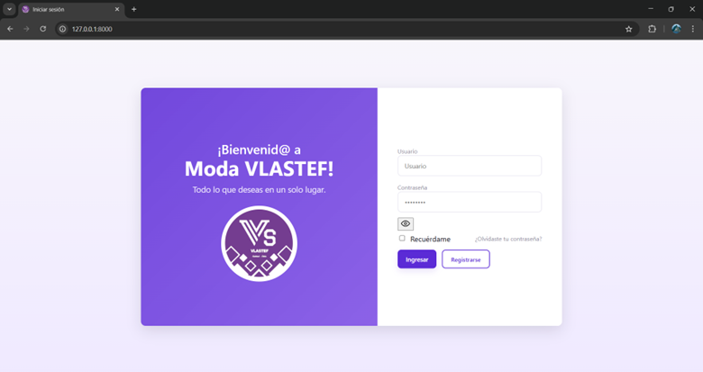
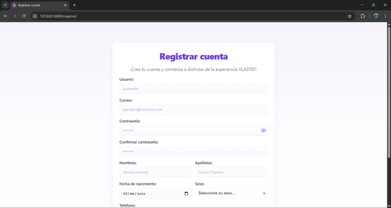
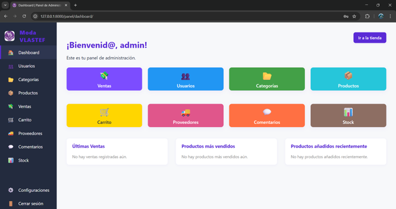
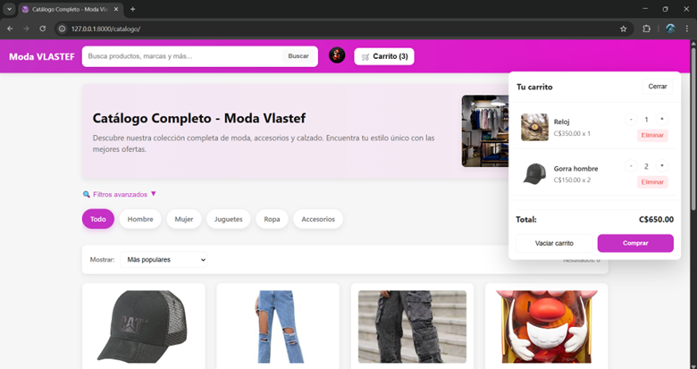
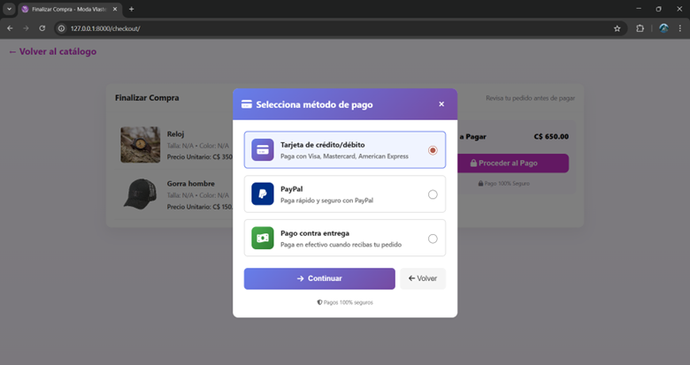

# Sistema-web-2025-AED
Sistema web de inventario, facturación y catálogo para el negocio Moda VLASTEF.

## Tecnologías usadas:
Para la elaboración de este sistema se utilizaron las siguientes tecnologías: HTML y CSS para la interfaz de Usuario, los lenguajes de programación Python y JavaScript para la lógica, el framework Django para el desarrollo del backend y el gestor PostgreSQL para la base de datos.

## Instalación:
Para la instalación y ejecución del sistema es necesario llevar a cabo una serire de requisitos esenciales para que pueda funcionar:

1. Uno de los requisitos esenciales es tener instalado:
```
-> Python 3.13.9 o inferior.
-> PostgreSQL 17.7 o inferior.
-> VSCode o cualquier IDE de preferencia.
-> Git.
``` 

2. Crea una carpeta en cualquier dirección de tu pc, accedes a la ubicación de esa carpeta mediante git bash y clonas el repositorio utilizando el siguiente comando:

```bash
git clone https://github.com/Israbsuwu/Sistema-web-2025-AED.git
```

3. Asegúrate que en la terminal accedas a la siguiente ubicación:

```bash
cd SISTEMA-WEB-2025-AED
```

4. Es recomendable crear un entorno virtual. Estando en la misma ubicación anterior lo creas colocando el siguiente comando en la terminal:
```
python -m venv mi_entorno (Reemplaza "mi_entorno" por el nombre que desees). 
```

5. Ahora debes activar tu entorno. Si utilizas 'Git Bash' como terminal en tu VSCode pon lo siguiente para activarlo:
```
source mi_entorno/Scripts/activate (Reemplaza "mi_entorno" por el nombre que colocaste). 
```
Para asegurarse de que esté activado debería de aparecerte en tu terminal el nombre de tu entorno entre paréntesis. Cada vez que quieras ejecutar el proyecto asegúrate de tener activado el entorno virtual.
```
(mi_entorno)
``` 

6. Ahora coloca en la terminal lo siguiente para instalar las dependencias:

```bash
pip install -r requirements.txt
```

7. Luego dirigite a la carpeta del proyecto de Django:

```bash
cd sistema_web
```

8. Ahora, es importante crear la base de datos. Si ya tienes PostgreSQL puedes saltarte este paso, si no, es obligatorio que tus configuraciones al momento de instalarlo tengan lo siguiente:
```bash
USER: postgres
PASSWORD: 123456789
HOST: localhost
PORT: 5432
```

9. Debes verificar que en "settings.py" que se encuentra en la siguiente ubicación:
```
Sistema-web-2025-AED/sistema_web/sistema_web/settings.py
```
los campos de USER, PASSWORD, HOST y PORT deben de ser los mismos que tú tienes configurado en tu postgres; si no los tienes así, entonces cámbialos dentro de "settings.py", pon los tuyos y guardas los cambios. Eso se encuentra a partir de la línea 82 en "settings.py".

10. Ahora crea la  base de datos dentro de pgAdmin poniendo el mismo nombre que sale en "settings.py":
```
bd_web
```

11. Volviendo al VSCode en donde tienes el proyecto realiza las migraciones colocando en la terminal lo siguiente:

```bash
python manage.py makemigrations
```
```
python manage.py migrate
```

En la terminal debería de aparecerte mensajes con algunos "OK". Si es así, entonces las migraciones se completaron correctamente, si no, verifica si realizaste bien los pasos anteriores.

12. Si todo lo anterior está correcto, crea un súper usuario para poder acceder al panel de administración como administrador:

```bash
python manage.py createsuperuser
```
Te pedirá ingresar un nombre de usuario, correo y contraseña (no lo olvides).

13. Una vez creado es momento de ejecutar el proyecto:

```bash
python manage.py runserver
```
En la terminal encontrarás un enlace donde al presionar 'control + clic' te llevará a la página web.
Estando en la página tienes la opción de inciar sesión con el súper usuario ya creado o registrar una cuenta.
Para acceder al panel de administración inicia sesión con el súper usuario poniéndolo en el login junto con su contraseña.

## Imágenes:
Algunas imágenes del sistema ejecutado:

### Login:


### Register:


### Panel de administración:


### Catálogo:


### Comprar productos:

